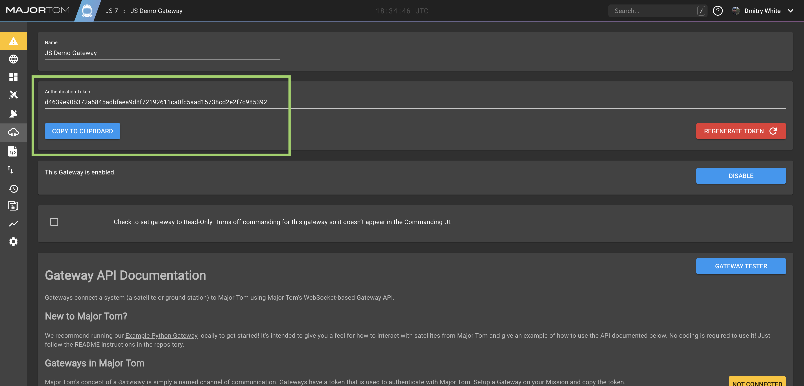
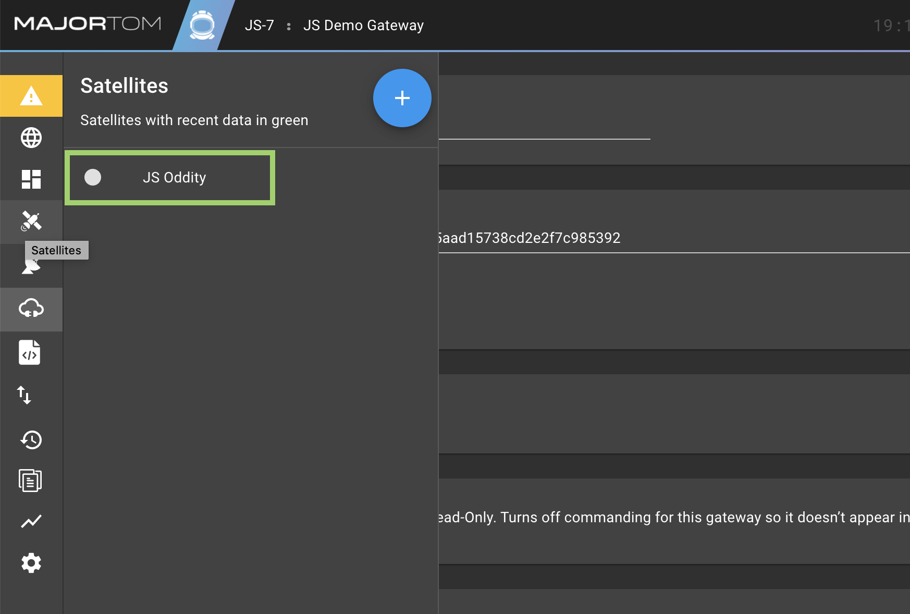

# Demo Gateway in NodeJS
A Gateway is the translation layer between Major Tom's Mission Control and your Satellite. This repo contains an example Gateway in JavaScript, and can be run locally.

## Background
Gateways are asynchronous by nature -- the primary interface is a bi-directional websocket. Actions taken by the operator are sent from Major Tom to your Gateway as messages. The underlying library then executes methods based on the type of message. NodeJS is uniquely suited to handle a Gateway's asynchronous behavior using its trademark Event and Stream paradigms.

## Gateway Package
This demo gateway uses the [Major Tom Gateway Package](https://npmjs.com/package/majortom-gateway) from npm. If you are looking to use this gateway as an example to write your own, you'll use that package to handle messages to and from Major Tom.


## Local Setup
1. Make sure you have git and [NodeJS & npm](https://nodejs.org) installed
2. Clone this repo with git
3. In a terminal window, navigate into the demo folder and install the project dependencies from npm
```sh
$ cd example-nodejs-gateway
$ npm install
```

## Major Tom Setup
Before running this app locally, you'll need to make a Gateway in Major Tom! Once you've received your login credentials for Major Tom, make a new mission, and you'll be prompted to add a Gateway to that mission.

Once you add the Gateway, you'll need the **Authentication Token** to connect the demo gateway. You can find it on the Gateway Page:


## Connect the Gateway
1. You'll need to edit the file found at `example-nodejs-gateway/connect/connection.json` in the following way:
```json
{
  "gatewayToken": "<YOUR-GATEWAY-TOKEN>",
  "host": "app.majortom.cloud (Or your Major Tom url host location)"
}
```
2. From a terminal window in the `example-nodejs-gateway` directory, start the app using the start script:
```sh
$ npm run start
```
3. You should see the intro text in the window, and then a JSON message from Major Tom:
```sh
{"type":"hello","hello":{"mission":"YOUR-MISSION-NAME"}}
```
4. You'll also see a log message showing that the example sat has sent Major Tom a copy of its command definitions. This will serve to automatically create the satellite in Major Tom if it doesn't exist yet, and set it up with the commands it recognizes.

### Note on Major Tom Deployment Environments
If you have Basic Authentication enabled on your deployment (usually true if you're accessing it over anything other than `app.majortom.cloud`), you'll need to enter those credentials in `example-nodejs-gateway/connect/connection.json` to connect.

Enter basicauth login credentials for your Major Tom deployment (if it’s active) in the form `"basicAuth": "<username>:<password>@"`, for example: `"basicAuth": "kubos:password123@"`.

If you are running the on-prem version of Major Tom, you'll need to include the field `"http": true` in `example-nodejs-gateway/connect/connection.json`, as we currently do not support https for on prem.

## What does this Demo do?
Now that you've connected the gateway, it will automatically create a new satellite (as noted above) and load command definitions for it.

You can now issue those commands to the satellite through the connected Gateway, which accomplish a wide variety of simulated tasks. Open each command and read its description to understand what it does!

To find these commands, go to Major Tom under the mission you originally created and look up JS Oddity in the Satellites Menu:



Clicking on it will take you to its commanding page, and you can fire away!

## What's next?
### Set up your Mission Dashboard
The Mission Dashboard allows you to monitor and control everything on the Mission. Add cards and play with their settings to see what you can do!

### Integrate Your System
Now that you understand how the integration works, try augmenting the Demo Gateway to actually communicate with your hardware and software! Then you can begin controlling and monitoring your own spacecraft. If you want to get a better sense of how easy it is to build a Gateway in NodeJS, start by looking at the source code in `example-nodejs-gateway/index.js`!
